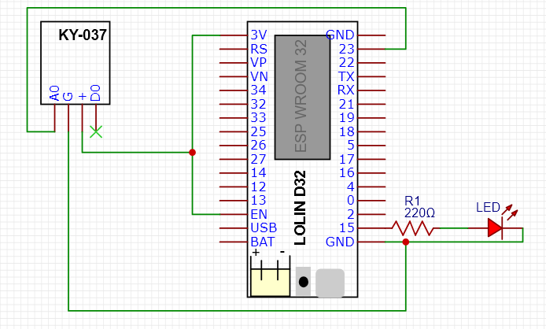

# Projects-for-Python-Class
# Project Thanos

## Team Members
- Johanna-Mae Tolentino 
- Sabrina Hassain

## Project Overview
Control an LED (on/off and brightness) using clap/snap patterns. The ESP32 processes sound sensor input and communicates with Raspberry Pi via MQTT for monitoring and control. The raspberry pi will send the final LED control command back to the ESP32.

## Components
- Raspberry Pi 
- ESP32 Freenove WROOM board 
- KY-037 Sound Sensor
- LED
- Resistor 220Ω
- Breadboard and jumper wires

## Schematics

## System Analysis

Which applications will handle which tasks?
KY-037 Sound Sensor: Detects sounds and send an analog signal to ESP32.
ESP32: Reads the sensor input and detects the claps, publishes the clap pattern + timing info to MQTT, Receives LED control commands from the Raspberry Pi (ON/OFF + Brightness level (0-255 PWM)
Raspberry Pi: Runs the MQTT broker, subscribes to MQTT topics to receive status updates from the ESP32, calculates LED brightness using the average clap period, publishes LED commands back to ESP32.

## Which conditions will lead to which results?

| **Condition / Input**                              | **Processing (by ESP32)**                                | **Result / Output**                                                            |
| -------------------------------------------------- | -------------------------------------------------------- | ------------------------------------------------------------------------------ |
| **1 clap detected**                              | Pattern = 1, average period computed                     | Raspberry Pi sends: `LED_OFF`                     |
| **2 claps detected**                             | Pattern = 2, period computed                    | Raspberry pi sends: `LED_ON`                     |
| **3 claps detected**                           | Pattern = 3                      | Raspberry pi maps period → brightness and sends `BRIGHTNESS_SET`    |
| **4 claps detected**                            | Pattern = 4                  | Raspberry pi maps period → brightness (lower or higher depending on mapping)    |
| **No sound detected**                              | Idle state.                                              | LED maintains previous state (no change).                                      |
| **Command sent from Raspberry Pi**                 | Publishes override message.                              | ESP32 receives MQTT message and updates LED                                    |
 
